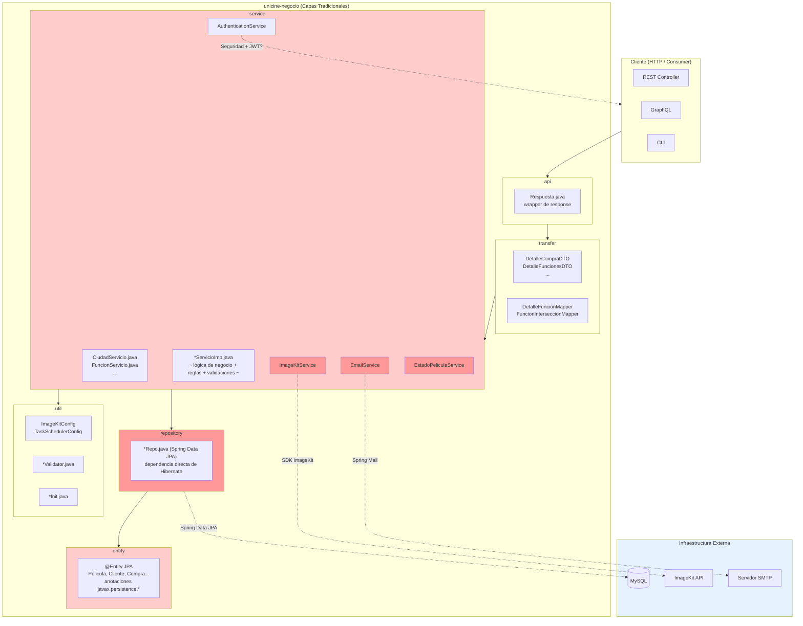
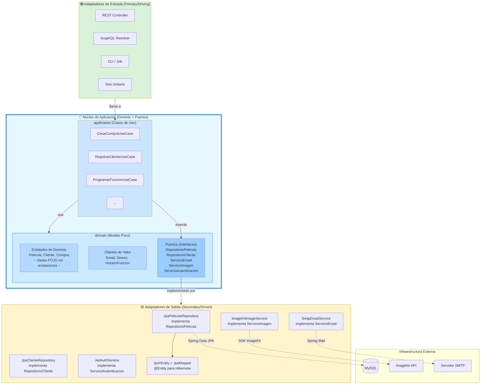
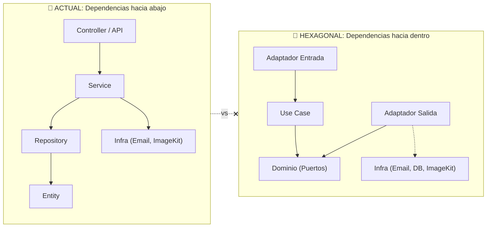
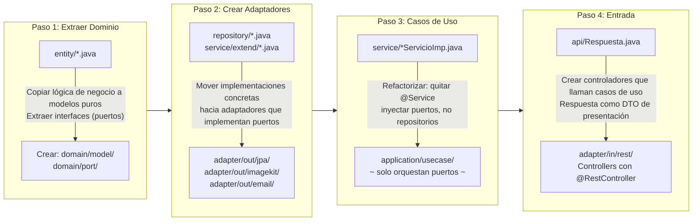
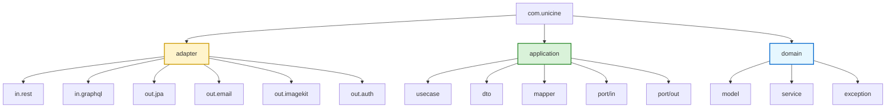

# Comparativa: Arquitectura Actual vs Arquitectura Hexagonal

## Resumen Ejecutivo

| Aspecto | Actual (Layered) | Hexagonal |
|---------|---------------|-----------|
| **Acoplamiento** | Alto: Servicios dependen directamente de JPA, Spring, librerías externas | Bajo: El dominio no conoce frameworks |
| **Testeabilidad** | Requiere contexto Spring / DB real | Domain testable puro (sin Spring) |
| **Flexibilidad** | Cambiar DB o librería implica tocar negocio | Solo se cambian adaptadores |
| **Complejidad inicial** | Baja | Media (más paquetes, interfaces) |
| **Escalabilidad** | Se degrada con el tamaño | Se mantiene lineal |

---

## Diagrama 1: Arquitectura Actual (Por Capas Tradicionnal)



### Problemas identificados en la arquitectura actual:

1. **Las entidades JPA son el modelo de dominio**: Están anotadas con `@Entity`, acopladas a Hibernate
2. **Los servicios son God Objects**: Mezclan lógica de negocio, reglas de aplicación, llamadas a servicios externos (Email, ImageKit, Auth)
3. **Dependencia directa de infraestructura**: `ImageKitService`, `EmailService` y `AuthenticationService` viven junto a la lógica de negocio
4. **Los repositorios exponen JPA**: Cualquier cambio de ORM o DB impacta los servicios directamente
5. **Difícil de testear unitariamente**: Requiere levantar contexto Spring + DB real para probar servicios

---

## Diagrama 2: Arquitectura Hexagonal (Propuesta)



---

## Diagrama 3: Comparación de Flujo de Dependencias



---

## Diagrama 4: Mapa de Migración Paso a Paso



---

## Evaluación: ¿Es complicado para Unicine?

### Factores que la hacen FÁCIL ✅

| Factor | Estado |
|--------|--------|
| **Tamaño** | ~20 entidades, ~15 servicios. Muy manejable. |
| **Módulos** | Solo `negocio`. No hay que coordinar múltiples módulos. |
| **Framework** | Spring Boot facilita inyección de dependencias y configuración de beans. |
| **Tests** | Ya tiene tests de servicio. Sirven de base para validar la migración. |
| **Dependencias externas** | Solo 3: MySQL (JPA), ImageKit, Email. Pocos adaptadores a crear. |

### Desafíos a considerar ⚠️

| Desafío | Solución |
|---------|----------|
| **Entidades JPA anotadas** | Crear clases de dominio puras + mappers a entidades JPA (adapter) |
| **Servicios mezclados** | Separar en: UseCase (orquestación), DomainService (lógica pura), Adapter (infra) |
| **DTOs y Mappers** | Los DTOs actuales pueden quedar en `application/dto/` o `adapter/in/rest/dto` |
| **Configuración Spring** | Usar `@Configuration` en capa `adapter/` para crear beans de adaptadores |

### Esfuerzo estimado

- **Proyectos pequeños** (< 10 entidades): 1-2 días
- **Proyectos medianos** (10-30 entidades, como Unicine): **3-5 días**
- **Proyectos grandes** (> 30 entidades): 1-2 semanas

> 💡 **Recomendación**: No migrar todo de golpe. Empezar por un solo agregado (ej: `Compra` o `Funcion`), validar el patrón, y luego replicar.

---

## Diagrama 5: Vista de Paquetes Propuesta (Hexagonal)



### Regla de oro de paquetes:

```
domain/     ← NO depende de NINGÚN framework (Spring, JPA, etc.)
application/ ← Solo depende de domain/
adapter/    ← Puede depender de application/ y domain/
```

---

## Conclusión

Para **Unicine** la arquitectura hexagonal es:

- **Factible**: El proyecto es de tamaño medio, un solo módulo.
- **Beneficiosa**: Mejorará testeabilidad, desacoplará el dominio de JPA, y permitirá cambiar infraestructura sin tocar negocio.
- **No compleja**: Spring Boot ya tiene DI, solo hay que reorganizar paquetes y extraer interfaces.
- **Progresiva**: Se puede adoptar agregado por agregado sin rewrite total.

> 🚀 **Veredicto**: No es complicado. Es una inversión de 3-5 días que paga dividendos en mantenibilidad y testing.
