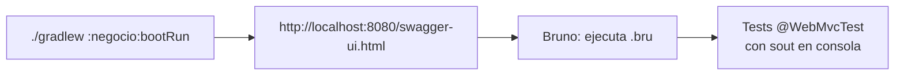

# Bruno — Colecciones UniCine

> Cliente API offline-first, archivos `.bru` versionados en Git (sin nube).

## Cómo abrirlo (estás en My Workspace ahora)

1. En **Bruno** (tu captura): click **Create Collection** o **Open Collection**
2. Selecciona la carpeta `bruno-unicine` del proyecto (raíz `Cine/bruno-unicine`)
3. Aparecerá `unicine-api` con 6 subcarpetas: `ciudades`, `teatros`, `salas`, `peliculas`, `colecciones`, `disposiciones`
4. Click en **Environments** → crea/usa `local` → `baseUrl=http://localhost:8080`

## Flujo recomendado 4.2

1. Levanta backend: `./gradlew :negocio:bootRun` (puerto 8080)
2. Abre Swagger: `http://localhost:8080/swagger-ui.html` y `http://localhost:8080/v3/api-docs`
3. En Bruno, ejecuta `ciudades/listar` → debe dar `200` sin auth (ruta pública)
4. Ejecuta `ciudades/crear` → sin auth debe dar `401 {code: DOMAIN_USER_AUTH_INVALID_CREDENTIALS}`
5. Prueba error: `ciudades/crear-invalido` con `{"nombre":""}` → `400 {details:[{field:"nombre"}]}`

## QUERY demo (RFC 10008)

En `peliculas/query-demo.bru` hay un body JSON. Hoy es `POST /api/peliculas/query`. Para probar el futuro método `QUERY`:

- En Bruno: duplicated request → cambia método manualmente escribiendo `QUERY` (Bruno permite métodos custom)
- Misma URL `{{baseUrl}}/api/peliculas/query`, mismo `Content-Type: application/json`, mismo body
- Es **safe/idempotente/cacheable** como `GET` pero con body — ideal para filtros gigantes que no caben en `?filtro=...`

En tests automatizados: `PeliculaControllerTest.demoQueryViaPostEquivalente200` y `demoQueryMetodoQueryRealConMockMvc` muestran ambas formas y hacen `sout` del JSON.

## Tips

- Archivos `.bru` son texto plano → se commitean sin conflicto (mejor que Postman cloud)
- Puedes duplicar `local` → `prod` con otro `baseUrl`
- Documentación interactiva alternativa: Swagger UI (incluido), Redoc/Scalar (ver Notion 4. Referencia Técnica)
- Si un request da `403`, añade auth (Fase 5 JWT) en header `Authorization: Bearer <token>`
