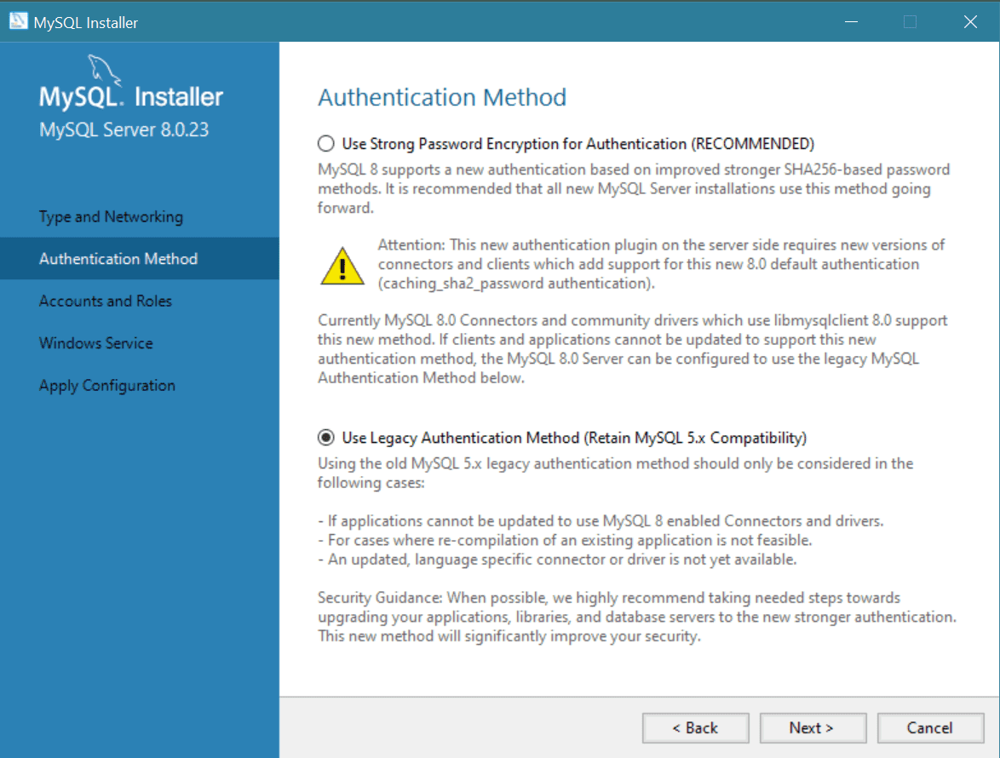

# Proyecto UniCine

Es una aplicación web desarrollada con **Spring Boot** que ofrece una plataforma integral para la gestión y experiencia de usuario en cines a nivel nacional en Colombia. Esta aplicación tiene como objetivo centralizar la información de múltiples salas de cine, permitiendo a los usuarios consultar carteleras, reservar entradas y gestionar sus experiencias cinematográficas de manera eficiente y amigable.

> [!CAUTION]
> En caso de existir alguna entidad real con el mismo nombre de la plataforma, esta aplicación no pretende representarla ni está afiliada de ninguna manera a dicha entidad. Cualquier similitud con nombres, marcas o servicios reales es pura coincidencia.

---

## Resumen del Proyecto

**UniCine** es un backend REST construido con Spring Boot 3.3.4 y Java 21. El módulo principal (`negocio`) implementa toda la lógica de negocio de una cadena de cines nacional, cubriendo:

- Gestión de **películas**, **funciones** y **carteleras**
- Administración de **teatros**, **salas** y **distribución de sillas**
- Compra y reserva de **entradas** y **confitería**
- Gestión de **usuarios** (clientes y administradores)
- Sistema de **cupones** y **colecciones** de descuento
- Integración con **ImageKit** para manejo de imágenes
- Envío de **correos electrónicos** transaccionales
- Generación de **códigos QR** para entradas
- Programación de tareas automáticas (e.g. actualización de estado de películas)

---

## Estructura del Proyecto

```
unicine-i/                          ← Proyecto raíz (Gradle multi-módulo)
├── build.gradle                    ← Configuración global de Gradle
├── settings.gradle                 ← Define el módulo 'negocio'
├── readme.md                       ← Este archivo
├── readme/images/                  ← Imágenes de la documentación
└── negocio/                        ← Módulo principal (Spring Boot)
    ├── build.gradle                ← Dependencias del módulo
    └── src/
        ├── main/
        │   ├── java/com/unicine/
        │   │   ├── Main.java                        ← Punto de entrada Spring Boot
        │   │   ├── api/response/
        │   │   │   └── Respuesta.java               ← Envoltorio genérico de respuestas API
        │   │   ├── entity/                          ← Entidades JPA (dominio)
        │   │   │   ├── Persona.java                 ← Clase base de personas
        │   │   │   ├── Administrador.java
        │   │   │   ├── AdministradorTeatro.java
        │   │   │   ├── Cliente.java
        │   │   │   ├── Ciudad.java
        │   │   │   ├── Teatro.java
        │   │   │   ├── Sala.java
        │   │   │   ├── DistribucionSilla.java
        │   │   │   ├── Pelicula.java
        │   │   │   ├── PeliculaDisposicion.java
        │   │   │   ├── Funcion.java
        │   │   │   ├── FuncionEsquema.java
        │   │   │   ├── Horario.java
        │   │   │   ├── Compra.java
        │   │   │   ├── CompraConfiteria.java
        │   │   │   ├── Confiteria.java
        │   │   │   ├── Entrada.java
        │   │   │   ├── Cupon.java
        │   │   │   ├── CuponCliente.java
        │   │   │   ├── Coleccion.java
        │   │   │   ├── Imagen.java
        │   │   │   ├── composed/                    ← Claves compuestas (@EmbeddedId)
        │   │   │   │   ├── ColeccionCompuesta.java
        │   │   │   │   └── PeliculaDisposicionCompuesta.java
        │   │   │   └── interfaced/
        │   │   │       └── Imagenable.java          ← Interfaz para entidades con imágenes
        │   │   ├── enumeration/                     ← Enumeraciones del dominio
        │   │   │   ├── EstadoPelicula.java
        │   │   │   ├── EstadoPropio.java
        │   │   │   ├── FormatoPelicula.java
        │   │   │   ├── GeneroPelicula.java
        │   │   │   ├── MedioPago.java
        │   │   │   ├── TipoSala.java
        │   │   │   └── TipoUsuario.java
        │   │   ├── repository/                      ← Repositorios Spring Data JPA
        │   │   │   ├── AdministradorRepo.java
        │   │   │   ├── AdministradorTeatroRepo.java
        │   │   │   ├── CiudadRepo.java
        │   │   │   ├── ClienteRepo.java
        │   │   │   ├── ColeccionRepo.java
        │   │   │   ├── CompraConfiteriaRepo.java
        │   │   │   ├── CompraRepo.java
        │   │   │   ├── ConfiteriaRepo.java
        │   │   │   ├── CuponClienteRepo.java
        │   │   │   ├── CuponRepo.java
        │   │   │   ├── DistribucionSillaRepo.java
        │   │   │   ├── EntradaRepo.java
        │   │   │   ├── FuncionEsquemaRepo.java
        │   │   │   ├── FuncionRepo.java
        │   │   │   ├── HorarioRepo.java
        │   │   │   ├── ImagenRepo.java
        │   │   │   ├── PeliculaDisposicionRepo.java
        │   │   │   ├── PeliculaRepo.java
        │   │   │   ├── SalaRepo.java
        │   │   │   └── TeatroRepo.java
        │   │   ├── service/                         ← Lógica de negocio (servicios)
        │   │   │   ├── interfaces (Servicios, e.g. CiudadServicio, TeatroServicio …)
        │   │   │   ├── implementaciones (*ServicioImp.java)
        │   │   │   └── extend/                      ← Servicios especializados
        │   │   │       ├── auth/AuthenticationService.java   ← Autenticación de usuarios
        │   │   │       ├── image/ImageKitService.java        ← Integración ImageKit CDN
        │   │   │       ├── mail/EmailService.java            ← Envío de correos (SMTP)
        │   │   │       └── state/EstadoPeliculaService.java  ← Tarea programada de estados
        │   │   ├── transfer/                        ← Objetos de transferencia de datos
        │   │   │   ├── data/                        ← DTOs
        │   │   │   │   ├── DetalleCompraDTO.java
        │   │   │   │   ├── DetalleFuncionesDTO.java
        │   │   │   │   ├── DetallePeliculaHorarioDTO.java
        │   │   │   │   ├── DetalleSillaDTO.java
        │   │   │   │   └── FuncionInterseccionDTO.java
        │   │   │   ├── mapper/                      ← Mapeadores DTO ↔ Entidad
        │   │   │   │   ├── DetalleFuncionMapper.java
        │   │   │   │   └── FuncionInterseccionMapper.java
        │   │   │   ├── projetion/                   ← Proyecciones de consultas JPQL
        │   │   │   │   └── DetalleFuncionesProjection.java
        │   │   │   └── record/
        │   │   │       └── VersionArchivo.java       ← Record para versión de archivo (ImageKit)
        │   │   └── util/                            ← Utilidades transversales
        │   │       ├── config/
        │   │       │   ├── ImageKitConfig.java       ← Configuración del cliente ImageKit
        │   │       │   └── TaskSchedulerConfig.java  ← Configuración del scheduler de tareas
        │   │       ├── funtional/image/
        │   │       │   ├── ProcesadorImagen.java     ← Procesamiento y redimensión de imágenes
        │   │       │   └── RefactorizadorRuta.java   ← Reescritura de rutas de imágenes
        │   │       ├── initializer/
        │   │       │   ├── HorarioDescuentoInit.java ← Inicialización de descuentos por horario
        │   │       │   └── SalaPrecioInit.java       ← Inicialización de precios de sala
        │   │       └── validation/
        │   │           ├── annotation/
        │   │           │   ├── MultiPattern.java            ← Anotación de validación multi-regex
        │   │           │   └── MultiPatternValidator.java
        │   │           └── attributes/              ← Validadores de atributos por entidad
        │   │               ├── CiudadAtributoValidator.java
        │   │               ├── DistribucionAtributoValidator.java
        │   │               ├── PeliculaAtributoValidator.java
        │   │               ├── PersonaAtributoValidator.java
        │   │               ├── SalaAtributoValidator.java
        │   │               └── TeatroAtributoValidator.java
        │   └── resources/
        │       ├── application.properties           ← Configuración principal (DB, JPA, Mail)
        │       └── logback-spring.xml               ← Configuración de logging
        └── test/
            ├── java/com/unicine/test/
            │   ├── repository/                      ← Tests de repositorios (17 clases)
            │   └── service/                         ← Tests de servicios (13 clases)
            └── resources/
                └── dataset.sql                      ← Dataset de prueba SQL
```

---

## Tecnologías Utilizadas

| Tecnología | Versión | Uso |
|---|---|---|
| Java | 21 | Lenguaje principal |
| Spring Boot | 3.3.4 | Framework web y de inyección de dependencias |
| Spring Data JPA | (incluido) | Acceso a datos con Hibernate |
| Spring Validation | (incluido) | Validación de entidades y DTOs |
| Spring Boot DevTools | (incluido) | Recarga en caliente en desarrollo |
| Spring Boot Mail | 3.4.0 | Envío de correos transaccionales |
| MySQL | 8.0.x | Base de datos relacional |
| Lombok | (incluido) | Reducción de código boilerplate |
| ImageKit Java SDK | 2.0.1 | CDN y gestión de imágenes |
| ZXing | 3.5.3 | Generación de códigos QR |
| Thumbnailator | 0.4.20 | Redimensión de imágenes |
| Jasypt | 1.9.3 | Cifrado de propiedades sensibles |
| Gson | 2.10.1 | Serialización/deserialización JSON |
| Gradle (Groovy DSL) | (multi-módulo) | Sistema de construcción |
| JUnit 5 | (incluido) | Pruebas unitarias e integración |

---

## Capas de la Arquitectura

```
┌─────────────────────────────────────┐
│          API / Controllers          │  ← (pendiente de implementar)
├─────────────────────────────────────┤
│         Services (Negocio)          │  ← Lógica de negocio ✅
├─────────────────────────────────────┤
│        Repositories (JPA)           │  ← Acceso a datos ✅
├─────────────────────────────────────┤
│         Entities / Domain           │  ← Modelo de dominio ✅
├─────────────────────────────────────┤
│    MySQL Database (unicine_db)      │  ← Persistencia ✅
└─────────────────────────────────────┘
       Servicios externos:
       - ImageKit (CDN de imágenes)
       - SMTP (correo electrónico)
```

> [!NOTE]
> La capa de controladores REST (endpoints HTTP) aún no ha sido implementada. El proyecto tiene el backend de negocio completamente funcional, listo para exponer una API REST.

---

## Estado Actual del Desarrollo

| Componente | Estado |
|---|---|
| Entidades JPA (21 entidades) | ✅ Implementado |
| Repositorios Spring Data (20 repos) | ✅ Implementado |
| Servicios de negocio (10+ servicios) | ✅ Implementado |
| DTOs y Proyecciones | ✅ Implementado |
| Validaciones personalizadas | ✅ Implementado |
| Servicio de imágenes (ImageKit) | ✅ Implementado |
| Servicio de correo (SMTP) | ✅ Implementado |
| Generación de QR (ZXing) | ✅ Implementado |
| Tareas programadas (Scheduler) | ✅ Implementado |
| Tests de repositorios | ✅ Implementado (17 clases) |
| Tests de servicios | ✅ Implementado (13 clases) |
| Controladores REST (API HTTP) | ⏳ Pendiente |
| Autenticación/Seguridad (JWT/OAuth) | ⏳ Pendiente |
| Frontend | ⏳ Pendiente |

---

## Ejecucion

### Elementos Necesarios

#### MySQL

Descarge la ultima version del programa: `MySQL` [🔗](https://www.mysql.com/). En el proceso del desarrollo se implemento con la `8.0.35` pero no deberia existir problemas de compatibiliad en futuro se planteará la necesidad de implimentar docker para evitar estos problemas, dependiendo de como escale el proyecto.

> [!IMPORTANT]
> 1. Realize el proceso de instalación normalmente llegando al punto donde pregunte por el método de autenticación marque Legacy Authentication Method (MySQL 5.x Compatibility).




> [!NOTE]
> 2, Es necesario asignarle al root una contraseña que en caso de no hacerlo puede presentar problemar en la configuracion del archivo: `application.properties` [🔗](https://github.com/CSBMStyles/Cine/blob/main/negocio/src/main/resources/application.properties) o de otro tipo.


#### JDK

Descargue el `JDK-21` en el enlace: [🔗](https://adoptium.net/es/) 

> [!NOTE]
> la version especifica es por el tema de las dependencias la configuracion esta en el `build.gradle` [🔗](https://github.com/CSBMStyles/Cine/blob/main/build.gradle)

### Entorno de Trabajo

En el caso de utilizar el IDE **Intellij Idea Ultimate**, no presenta problema en el proyecto ya que este cuenta con las extensiones necesarias pre-instaladas para trabajar.

> [!IMPORTANT]
> En el caso de utilizar el IDE **Visual Studio Code**, necesitamos instalar extensiones para trabajar con **Spring Boot**, afortunadamente existe un paquete que nos facilita el trabajo: `Spring Boot Extension Pack` [🔗](https://marketplace.visualstudio.com/items?itemName=vmware.vscode-boot-dev-pack)

> [!TIP]
> Ultimadamente al importar el proyecto en el IDE es necesario esperar un tiempo a que se inice el JDK e instalen las dependencias del `Gradle:Groovy`